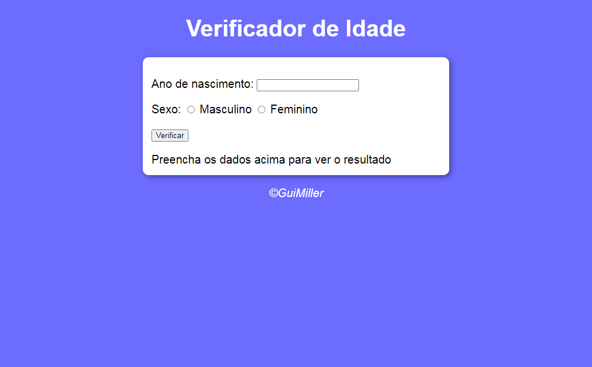

# Verificador de Idade

> Verificador

Projeto criado na aula do Curso em Vídeo 

## Tecnologias

- HTML
- CSS
- JavaScript
- Git e Github

## O que aprendi

- Criar um elemento com JavaScript
- Aninhamento de if-else
- Colocar id pelo JavaScript

## Contato

guilhermemillerblack@gmail.com